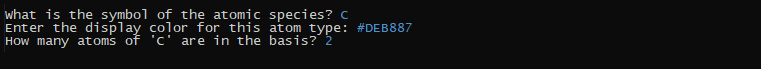

# 🖥️ Console Interface User Guide - Nook’iin
[(Versión en español)](./Guia_de_interfaz.md)

This guide provides step-by-step instructions for using the console interface of the Nook’iin program, designed to create and analyze two-dimensional multilayer systems using geometric methods.

---

## 📋 Table of Contents

1. [Prerequisites](#prerequisites)  
2. [Running the Interface](#running-the-interface)  
3. [Language Selection](#language-selection)  
4. [Main Menu](#main-menu)  
   4.1 [Lattice Loading Menu](#lattice-loading-menu)  
   &nbsp;&nbsp;&nbsp;&nbsp;4.1.1 [Manual Input](#manual-input)  
   &nbsp;&nbsp;&nbsp;&nbsp;4.1.2 [Import from File](#import-from-file)  
   4.2 [Lattice Menu](#lattice-menu)  
   &nbsp;&nbsp;&nbsp;&nbsp;4.2.1 [Check Lattice](#check-lattice)  
   &nbsp;&nbsp;&nbsp;&nbsp;4.2.2 [Rotate Lattice](#rotate-lattices)  
   &nbsp;&nbsp;&nbsp;&nbsp;4.2.3 [Save Lattice](#save-lattice)  
   4.3 [System Menu](#system-menu)  
   &nbsp;&nbsp;&nbsp;&nbsp;4.3.1 [Primitive Cell Calculation](#primitive-cell-calculation)  
   &nbsp;&nbsp;&nbsp;&nbsp;4.3.2 [Data Table for Matrices](#data-table-for-matrices)  
   &nbsp;&nbsp;&nbsp;&nbsp;4.3.3 [Show System](#show-system)  
   &nbsp;&nbsp;&nbsp;&nbsp;4.3.4 [Export to POSCAR](#export-to-poscar)  
5. [Credits and Contact](#credits-and-contact)


---
## Prerequisites  
- **Python 3.x** must be installed  
- The **Nook’iin** repository must be downloaded  
- Run the program from a terminal (Terminal, CMD or PowerShell)  
---
## Running the interface

From the repository's main folder, run the following in the terminal:

```bash
   python interface.py
   ```
---

## Language Selection

   When launched, the first menu displayed asks the user to select the language in which the interface will be shown: Spanish or English.

   

   Depending on the selected language, enter 1 for Spanish or 2 for English.

---

## Main Menu

Once the language is selected, the interface’s main menu is displayed. From here, the program’s main functionalities can be accessed. The available options are:

0. **-Instructions** → Displays a text with instructions for using the interface.  
1. **-Load lattices for the system** → Opens the menu to load the lattices that make up the system.  
2. **-Create system** → Opens the menu to create and work with the system built from the loaded lattices.  
3. **-Exit** → Terminates the program.


---

### Lattice Loading Menu

By choosing option **1** from the main menu, the lattice loading menu appears, offering the following options:

1. **Manual Input** → Opens a new menu to manually create the lattice by specifying its *primitive vectors* and *atomic basis*.  
2. **Import from File** → Prompts the user to enter the name of the VASP file corresponding to the lattice.  
3. **Done** → Returns to the main menu.


#### Manual Input

When selecting **Manual Input** to load a new lattice, the user is first asked to provide a name for the lattice (in this example, we will manually create a graphene lattice).


Next, the primitive vectors are defined component by component, starting with PV $a = (a_1, a_2, a_3)$.


The vector entered by the user will be shown, and the process continues with vectors $b = (b_1, b_2, b_3)$ and $c = (c_1, c_2, c_3)$.

Once the 3 primitive vectors are defined, they will be displayed, and the atomic basis definition begins. The first prompt asks for the number of distinct atomic species in the lattice’s atomic basis (in the case of graphene, there is only one atomic species: carbon).

For each of these atomic species, the user is prompted for a *symbol* to identify it (for carbon, the letter **C**), the *color* to represent it (Python color formats are accepted, both text-based like 'white', 'b', and hexadecimal formats), and the *number* of atoms of that species in the atomic basis.



With this data, the user must then specify the relative position (with respect to the previously defined primitive vectors) of each atom of the species being defined.


Once all the atoms in the atomic basis are defined, the lattice is created.

#### Import from File

When selecting **Import from File** to load a new lattice, the user is prompted for the path to the corresponding VASP file, omitting the *.vasp* extension. Some VASP files of crystal lattices are already available in the *VASP_Files* folder (in this example, we’ll import the file *GeSe_beta.vasp* from the *VASP_files* folder, corresponding to the $\beta$-GeSe lattice).


If the file is imported successfully, the lattice is now correctly loaded.

### Lattice Menu

Once a lattice has been correctly loaded, either manually or imported from a file, the lattice menu is accessed. It contains the following options:

0. **Save created lattice** → Saves the lattice to the list of lattices that will form the system and returns to the previous menu.  
1. **View POSCAR of the created lattice** → Displays the POSCAR file of the created lattice on screen.  
2. **View image of the created lattice** → Displays an image of the primitive cell of the lattice on screen.  
3. **Rotate the lattice** → Allows rotating the lattice before adding it to the system’s lattice list. This option is necessary to create systems formed by lattices with different relative orientations, where no rotational transformation for the PVs was previously considered when defining each layer’s lattice.  
4. **Create the lattice again** → Discards the lattice and starts its creation from scratch.  

#### Check lattice

If the user wants to ensure the lattice is correct before adding it to the system’s list, they can check it using options **1** and **2** of the lattice menu, either by verifying the POSCAR file or by viewing the image of the primitive cell.


*POSCAR of the imported GeSe lattice.*


*Image of the primitive cell of the imported GeSe lattice.*

#### Rotate lattices

To rotate a lattice in the system, option **3** of the lattice menu is selected. When doing so, the user is asked how many degrees the lattice will be rotated. Once the value is provided, the lattice will be rotated and its effect can be seen by requesting the image of the primitive cell after the transformation.

In our example, the system to be analyzed is a bilayer of $\beta$-GeSe on graphene with a relative rotation between layers of $13.52^\circ$, so we must rotate the $\beta$-GeSe lattice by $13.52^\circ$.


*Image of the primitive cell of the GeSe lattice after being rotated.*

#### Save lattice

If the defined lattice is correct, option **0** of the lattice menu is selected to add it to the list of lattices that will form the system. The order in which the lattices are saved to the list will be the same as their stacking order, where the first saved lattice will be the base of the stack (this will internally be considered by the program as the *substrate layer*).

After saving each lattice, the program returns to the *Lattice loading menu*, where a new lattice can be loaded or the process can be finished by selecting option **3**. Doing so will indicate how many lattices are saved and return to the *Main menu*, where the system can be initialized.

## System Menu

By selecting option **2** from the *Main Menu*, *Create system*, the **System Creation Menu** will be displayed, presenting the following options:

0. **Create system** → Initializes the system with the given networks as they are.
1. **Show loaded networks** → Displays a list with the names of the loaded networks.
2. **Add more networks** → Sends the user to the *Network Loading Menu* to add more networks.
3. **Exit** → Ends the execution of the program.

Once the list of networks is deemed correct, option **0** can be selected to initialize the system. If this is successfully completed, the **System Menu** will be displayed, presenting the following options:

0. **Calculate primitive cell** → Starts the process to calculate a primitive cell of the system.
1. **Rename the system** → Changes the name of the system.
2. **Show system** → If a PC has already been calculated for the system, it is displayed on screen.
3. **Show diffraction pattern** → Calculates the system's diffraction pattern and displays an image of it (requires that a PC has already been calculated).
4. **Export system as POSCAR file** → Generates the corresponding POSCAR file of the calculated PC (requires that a PC has already been calculated).
5. **Finish and exit** → Ends the execution of the program.

### Primitive Cell Calculation

By selecting option **0**, the process to calculate possible primitive cells for the system begins. The first thing requested from the user are the variables $n$, which determines the *search area* that limits the candidate supercells to be primitive cells, and $epsilon$, which defines a *limit* for the deformation that the system networks may have while maintaining periodicity.

If at least one possible primitive cell is found, the transformation matrix corresponding to the recommended candidate as the system's primitive cell will be displayed. In the example used, the values $n = 15$ and $epsilon = 0.03$ were used.


The new displayed menu presents the options:

0. **Use the selected TM to calculate the system PC** → Creates the primitive cell using the selected TM.
1. **Show table related to the selected TM** → Displays a table with information related to the selected TM.
2. **Select a new TM** → Displays all calculated transformation matrix options for the user to choose the most convenient.
3. **Perform a new search with different \( n \) and \( \epsilon \)** → Repeats the search with new values for the \( n \) and \( \epsilon \) variables.

### Data Table for Matrices

If option **1** or **2** is selected in the previous menu, a table with the corresponding information for each TM will be displayed. For each layer, the transformation matrices, deformation matrices, PV distortion values, and the number of atoms are shown. This data will help the user understand the effects of each TM and select the one most suitable for their problem.


Whether the matrix proposed by the system is accepted or another is chosen, option **0** from the menu must be used to create the corresponding primitive cell for the system. Once this is done, the interface will return to the *System Menu*.

### Show System

Once a PC is calculated, option **2** from the *System Menu* can be selected. Doing so will display a representation of the system in the real space of the calculated primitive cell, or in reciprocal space, as a superposition of the FBZs of each layer in a mesh formed by the periodic repetition of the calculated PC's FBZ.


*Representation in real space.*


*Representation in reciprocal space.*

It is also possible to obtain the system's diffraction pattern image by selecting option **3** from the *System Menu*. This will start the diffraction pattern calculation (this process may take several minutes if the primitive cell contains many atoms).


*Diffraction pattern corresponding to the example system.*

### Export to POSCAR

Once the system's PC is calculated, selecting option **4** from the *System Menu* will prompt the user for the name of the `.vasp` file in which the PC will be exported. The resulting file will be saved in the *VASP_files* folder.

The result of the example was exported to the file named `Graphene-beta_GeSe(13_52) System`.

## Credits and Contact

**Author:** Ossiel Aguilar-Spíndola  
**Academic Degree:** B.Sc. in Computer Science  
**Contact Email:** [OssielAE@ciencias.unam.mx](mailto:OssielAE@ciencias.unam.mx)  
**ORCID:** [0009-0002-8229-8543](https://orcid.org/0009-0002-8229-8543)

The *Nook’iin* program was developed as part of the undergraduate thesis *"Software for the Construction of Commensurable Two-Dimensional Multilayer Systems"*, under the supervision of Dr. Francisco Sánchez Ochoa at the Institute of Physics, National Autonomous University of Mexico (UNAM).

### License:  
This software is distributed under the GNU General Public License (GNU GPL). For more details, please refer to the `LICENSE` file.

### Acknowledgments:  
This project was made possible thanks to the support of various research programs and institutions. I express my gratitude to the following for their financial and academic support:

#### Research Support Programs:  
- PBIF24-2: Support for the completion of the thesis project.  
- DGAPA-PAPIIT (UNAM) IA105623: *Multilayer graphene under hydrostatic pressure: a first-principles study*.  
- CONAHCYT CF-2023-I-336: *Ab initio study of non-conventional pressurized van der Waals crystals*.  
- CONAHCYT 1564464: *Analogies in the physics of twisted 2D systems: from atomic to nanometric scales*.  
- CONAHCYT: Research assistant scholarship SNI-III.

#### Presentations and Dissemination:  
Partial results of this project were presented at the following scientific events:

- *2nd Annual Meeting, Analogies in the Physics of Twisted 2D Systems: from Atomic to Nanometric Scales* (2024), Pachuca, Hidalgo, Mexico.  
- *XII Annual Meeting of the Solid State Division* (2024), Xicotepec, Puebla, Mexico.  
- *Open Day at the Institute of Physics - UNAM* (2023), Mexico City, Mexico.  
- *Gathering on Transport at the Nanoscale* (2023), Cuernavaca, Morelos, Mexico.  
- *XVI International Conference on Surfaces, Materials and Vacuum* (2023), Zacatecas, Zacatecas, Mexico.

I sincerely appreciate the support and opportunities provided by these institutions, as well as the scientific community that contributed to the development and dissemination of this research.
